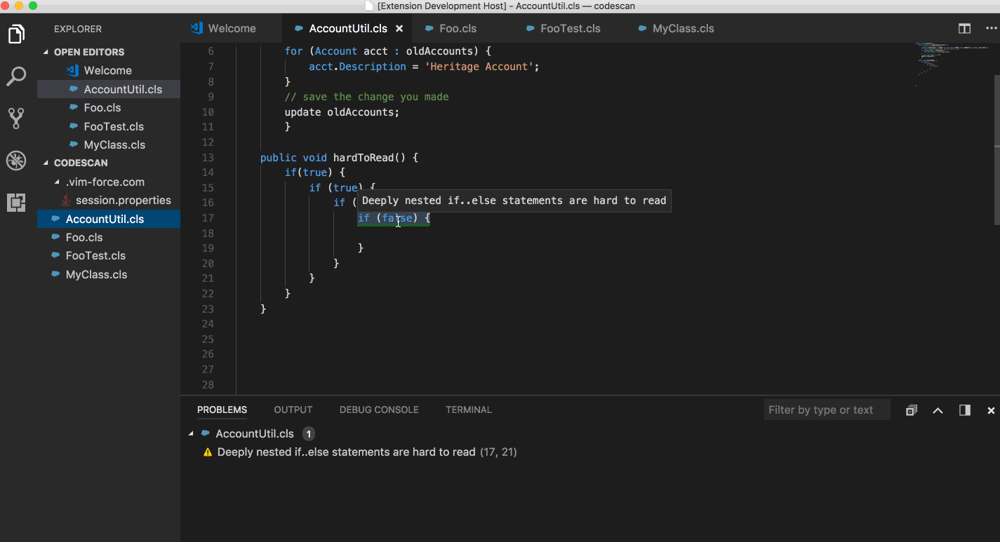

# VSCode Extension for apex-pmd

Allows you to run [Apex Static Code Analysis](http://pmd.sourceforge.net/snapshot/pmd-apex/) directly in vscode.


This based on the original work by [Chuck Jonas](https://github.com/ChuckJonas/vscode-apex-pmd)

## ANT task based PMD

If you are looking for ANT task based PMD for Apex, [here](https://github.com/mohan-chinnappan-n/pmd-dist) it is.

## Features Demo



### Current actions Supported

* Run analysis on file open
* Run analysis on file save
* Run analysis on entire workspace
* Run analysis on single file
* Ability to define your own ruleset

## Installation

1. Must have `JDK >=1.4` installed and in path
2. Download a [PMD "bin" release](https://sourceforge.net/projects/pmd/files/pmd/) (`>= 5.6`)
3. unzip to location of choice
4. In VScode, Open `Preferences: User Settings` and set `apexPMD.pmdPath` to folder where pmd was unzipped in step 3

## Sample Configuration

``` javascript

{
     // ...

    // absolute path to where PMD was installed
    // following example in my case
    "apexPMD.pmdPath":"/Users/mchinnappan/code-scan-tools/pmd/pmd-bin-5.8.1",
    // Set to false to use you own ruleset (set path)
     "apexPMD.useDefaultRuleset": "true",

     // Absolute path to ruleset xml file.  Must also set `useDefaultRuleset:false`.
    "apexPMD.rulesetPath": "",
    
    // Will run static analysis every time a file is opened
    "apexPMD.runOnFileOpen": "true",

    // Will run static analysis every time a file is saved
    "apexPMD.runOnFileSave": "true",

    // Determines at what priority level 'errors' will be added. Anything less will be a warning or hint
    "apexPMD.priorityErrorThreshold": "1",

    // Determines at what priority level 'warnings' will be added. Anything less will be a hint
    "apexPMD.priorityWarnThreshold": "3"

}


```

## Ruleset
Here is the [sample](./rulesets/apex_ruleset.xml) used in this extension